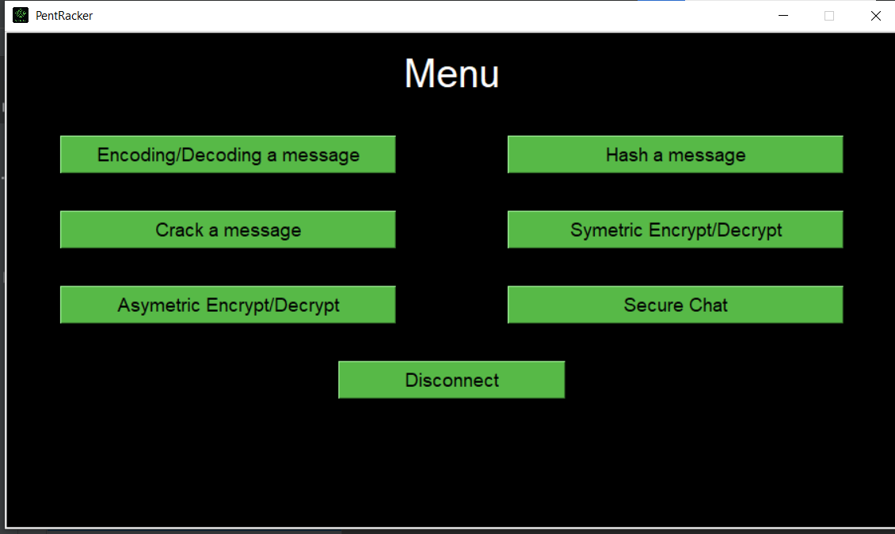

# TP Software Testing

## End 2 end Test

 

End-to-end testing is a technique used to check whether an application (website, mobile application, etc.) behaves as expected from start to finish. 
The tester must put himself in the shoes of a user and run the tests as if he were actually using the tool provided. 
This technique makes it possible to validate the operation of the front end. But also to check its integration with the back office and other webservices.

in our case we have created an end2end test that register a new user 
by filling the registration form then trying to login with the new account
we have used in this test the  **pyAutoGUI** . you can watch the following demo . 

##### click to watch the demo video

