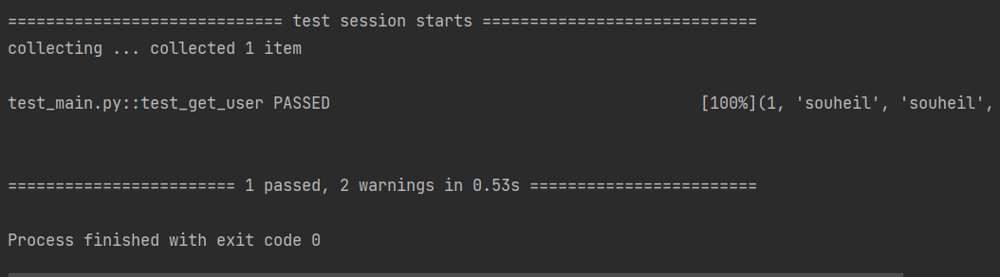

# TP Software Testing
### Integration Test


Integration testing is a way of testing software by grouping software components. In a complex software system, there are many interconnections applicable to a particular functionality, which makes it difficult to write integration tests.

in our case we will create a basic integration test for the integration of our remote sql data base with our app . 

in order to do that we have created test_DAO fixture which create a data base connection and
yield this connection to be injected in our tests and used to test the integration . it can also 
initiate the data base by creating a needed table in case it didn't existe . 
finally it will close the data base cnx after the execute of all of our tests .


``` python
@pytest.fixture(scope='session' ,)
def test_DAO() :
    # creating a new db connection
    DAO_obj=DAO()
    # in case you need to create table in database
    #DAO_obj.createTable()
    # add a new user to database
    #DAO_obj.register( 'souheil' , 'souheil' ,
    #'benslamasouheil@gmail.com' ,
    # '73ceb15f18bb0a313c8880abe54bf61a529dd8f1e75b084dd39926a1518d3d2f','99999999')
    yield DAO_obj
    # close the data base cnx after finishing all tests
    DAO_obj.db.close()
````


then we have created our test using the injected database connexion 
 
````python

def test_get_user(test_DAO):
    # given
    expected_user= (1, 'souheil', 'souheil', 'benslamasouheil@gmail.com', '99728986', '73ceb15f18bb0a313c8880abe54bf61a529dd8f1e75b084dd39926a1518d3d2f', None)
    # when
    result = test_DAO.getuser("benslamasouheil@gmail.com")
    print(result)
   # then
    assert(result,expected_user)
````

then our tests have passed 

test_add_user : 


test_get_user : 

